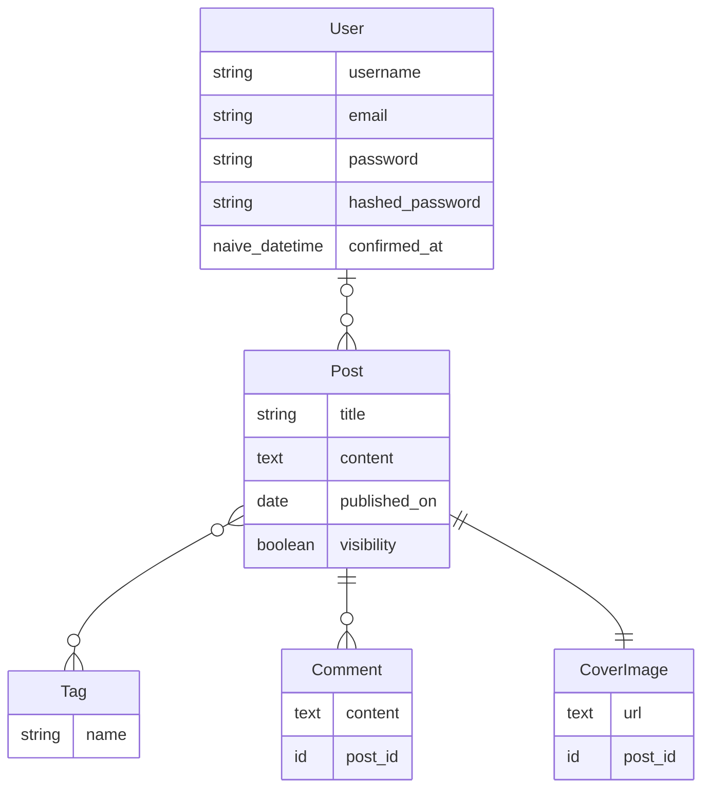

# Blog  
Name  

**Blog Server**  

**Summary**  
This will be a project to show how to build a blog website. This should have quite a fe w steps and require a lot of knowledge of the Phoenix library as well as Ecto.  

Once done you should be able to: add tags, create a comment, add a cover image, as well as create a blog.  

**Technologies**  
Phoenix  
Elixir  

**Contributors**  
Me  
Let me know if you want to contribute  

**Diagram**  
The overall project should follow this structure.  
